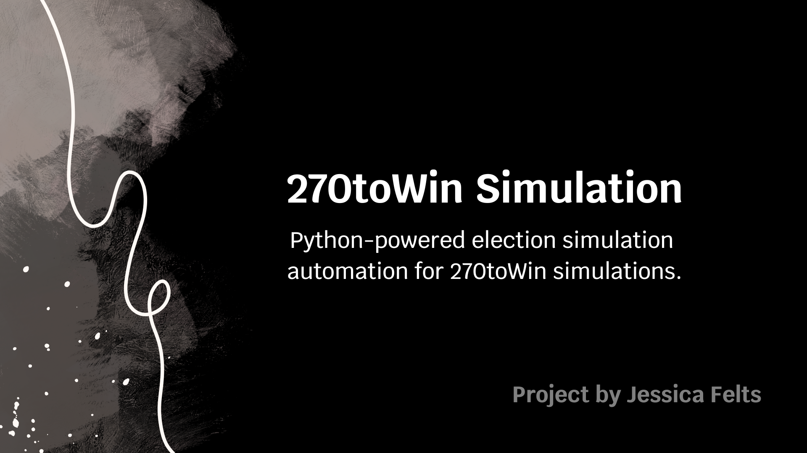

# 270toWin Simulation Automation

This project automates the 270toWin 2024 Election Simulation to record simulation outcomes and provide summary statistics. The script uses Selenium to interact with the website and execute multiple simulations, logging each outcome.



## Requirements

- Python 3.7+
- Selenium (`pip install selenium`)
- Webdriver Manager (`pip install webdriver-manager`)

## Setup

1. **Install Dependencies**:
   ```
   pip install selenium webdriver-manager
   ```

2. **WebDriver**:
   - The script uses Chrome WebDriver, which is managed automatically by WebDriver Manager.

## Usage

Run the `automation.py` script to execute the simulation:

```bash
python automation.py
```

### Configuration

The following parameters can be configured directly in the script:

- `simulation_count`: Sets the number of simulations to run (default: 100).
- `wait_time`: The time to wait after each simulation is triggered, allowing it to complete (default: 6 seconds).

### Simulation Execution

1. **Load the 270toWin Simulation Page**:
   The script opens the 270toWin 2024 simulation page and sets the simulation speed to the maximum (ID: `sim_speed_4`).

2. **Run Simulations**:
   - For each simulation run:
     - Click the "Run Simulation" button to start.
     - Wait for the simulation to complete.
     - Retrieve results for Harris and Trump from the page.
     - Update win counters and percentages based on the retrieved values.

3. **Output Summary**:
   - For each simulation, the script prints:
     - The simulation result (winner: Harris, Trump, or Tie).
     - Counts and win percentages for Harris, Trump, and Tie outcomes.

4. **Final Summary**:
   After all simulations are completed, the script provides a cumulative summary of Harris and Trump’s wins and the percentage of simulations that ended in a tie.

### Example Output

```
--------------------------------------------------------------------------------
Simulation 1: Harris Wins.
----------
Harris: 278, Trump: 260
Harris has won 100.00% of simulations. (1 out of 1)
...
--------------------------------------------------------------------------------
Simulation 100: Trump Wins.
----------
Harris: 248, Trump: 290
Trump has won 55.00% of simulations. (55 out of 100)
```

### Notes

- **Simulation Speed**: The script sets the simulation speed to the maximum setting available on the page to minimize runtime.
- **Browser Window**: The `finally` block is commented out to keep the browser open after the script finishes. Uncomment it to close the browser automatically after completion:
  ```python
  finally:
      driver.quit()
  ```